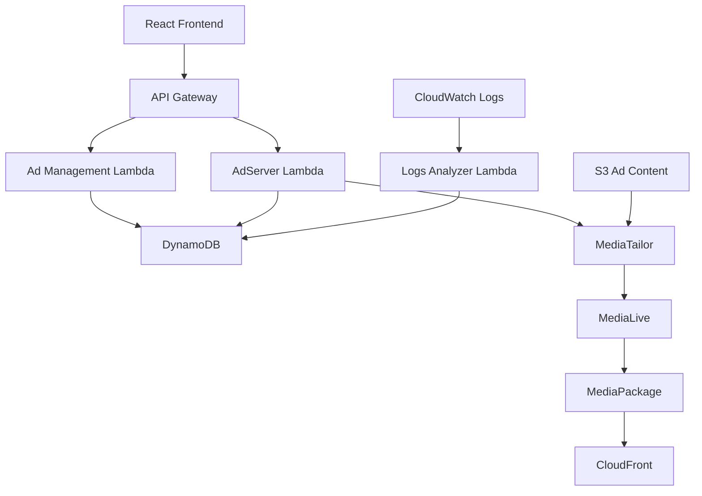

# SpaceAds Development Guide

## 📋 프로젝트 개요

**SpaceAds**는 AWS MediaTailor와 MediaLive를 활용한 실시간 동적 광고 삽입 시스템입니다. 
실시간 스트리밍 환경에서 정밀한 초단위 광고 스케줄링과 관리를 제공하며, 실제 광고 노출 데이터를 추적하여 정확한 성과 측정을 지원합니다.

### 🎯 주요 기능
- **초단위 정밀 스케줄링**: 정확한 타이밍으로 광고 삽입
- **실시간 광고 노출 추적**: MediaTailor CloudWatch Logs 기반 실제 노출 데이터 수집
- **동적 광고 선택**: 컨텍스트 기반 최적 광고 매칭
- **성과 모니터링**: 6개 핵심 메트릭 대시보드
- **CSV 데이터 내보내기**: 상세한 성과 분석 지원

---

## 🏗️ 시스템 아키텍처

### 전체 아키텍처


### 핵심 구성 요소

#### 1. **Frontend (React Dashboard)**
- **위치**: `frontend/`
- **기술스택**: React 18.2.0, Axios, React DatePicker
- **주요 기능**:
  - 광고 업로드 및 관리
  - 스케줄 생성 및 모니터링
  - 실시간 성과 대시보드
  - CSV 데이터 내보내기

#### 2. **Backend API (Lambda Functions)**
- **Ad Management API** (`aws/lambda/ad-management-api.py`)
  - 광고 CRUD operations
  - 스케줄 관리
  - 성과 데이터 조회
- **AdServer** (동적 광고 선택 및 VAST XML 생성)
- **MediaLive Integration** (`aws/lambda/medialive-integration.py`)
  - SCTE-35 스케줄 연동
- **CloudWatch Logs Analyzer** (`aws/lambda/cloudwatch-logs-analyzer.py`)
  - MediaTailor 로그 분석
  - 실제 광고 노출 데이터 수집

#### 3. **데이터 저장소**
- **DynamoDB Tables**:
  - `AdInventoryTable`: 광고 인벤토리 및 메타데이터
  - `AdPerformanceTable`: 성과 데이터 및 스케줄 이력
  - `AdScheduleTable`: 광고 스케줄 관리
- **S3 Bucket**: 광고 콘텐츠 저장 및 CDN

#### 4. **AWS 미디어 서비스**
- **MediaTailor**: 동적 광고 삽입 서비스
- **MediaLive**: 실시간 스트리밍 인코딩
- **MediaPackage**: 스트림 패키징 및 전송
- **CloudFront**: CDN 및 최종 스트림 배포

---

## 🚀 개발 환경 설정

### 필수 요구사항
- **Node.js**: 16.x 이상
- **AWS CLI**: 2.x 이상 
- **AWS 계정**: MediaTailor, MediaLive, DynamoDB 권한 필요

### 로컬 개발 환경 구성

#### 1. 프론트엔드 설정
```bash
cd frontend/
npm install
npm start
```

#### 2. 환경 변수 설정
```bash
# frontend/env.example을 참고하여 .env 파일 생성
cp env.example .env

# 주요 환경 변수
REACT_APP_API_ENDPOINT=https://your-api-domain.com
REACT_APP_REGION=ap-northeast-2
```

#### 3. AWS 인프라 배포
```bash
# CloudFormation 스택 배포
aws cloudformation deploy \
  --template-file aws/spaceads-infrastructure.yaml \
--stack-name spaceads-demo \
  --capabilities CAPABILITY_IAM \
  --parameter-overrides Environment=demo Owner=yourname
```

### 프로젝트 구조
```
ad-service/
├── frontend/                    # React 대시보드
│   ├── src/
│   │   ├── components/         # React 컴포넌트
│   │   ├── services/          # API 호출 서비스
│   │   └── App.js             # 메인 애플리케이션
│   ├── package.json
│   └── env.example
├── aws/
│   ├── spaceads-infrastructure.yaml  # CloudFormation 템플릿
│   └── lambda/                # Lambda 함수들
│       ├── ad-management-api.py
│       ├── cloudwatch-logs-analyzer.py
│       └── medialive-integration.py
├── ad-content/                # 광고 콘텐츠 샘플
├── Plan/                      # 설계 문서
├── SpaceAds_API.md             # API 문서
├── SpaceAds_Development_Summary.md  # 개발 요약
└── development.md            # 이 문서
```

---

## 🛠️ 기술 스택

### Frontend
- **React**: 18.2.0 (함수형 컴포넌트, Hooks)
- **Axios**: HTTP 클라이언트
- **React DatePicker**: 날짜/시간 선택
- **Date-fns**: 날짜 유틸리티

### Backend
- **AWS Lambda**: Python 3.9 런타임
- **API Gateway**: REST API
- **DynamoDB**: NoSQL 데이터베이스
- **S3**: 객체 스토리지

### AWS 미디어 서비스
- **MediaTailor**: 서버사이드 광고 삽입 (SSAI)
- **MediaLive**: 실시간 비디오 처리
- **MediaPackage**: 비디오 패키징
- **CloudFront**: 콘텐츠 전송 네트워크

### 모니터링 및 로깅
- **CloudWatch**: 로그 및 메트릭
- **CloudWatch Logs Insights**: 로그 분석
- **DynamoDB Streams**: 실시간 데이터 변경 감지

---

## 📊 핵심 기능 상세

### 1. 초단위 정밀 스케줄링 (Phase 15)

#### 정확한 초 매칭 알고리즘
```python
def get_exact_second_match(self, target_time):
    target_second = target_time.strftime('%Y-%m-%dT%H:%M:%S')
    # ISO 형식에서 초까지 정확히 매칭
    if schedule_time.startswith(target_second):
        return item
```

#### 하이브리드 매칭 시스템
- **정확한 초 매칭**: 우선순위 1
- **±1초 허용 오차**: 네트워크 지연 대응
- **중복 처리 방지**: 동일 스케줄 여러 번 실행 방지

#### 상태 관리
```python
# 스케줄 상태 흐름
scheduled → processing → completed/failed
```

### 2. MediaTailor CloudWatch Logs 연동 (Phase 17)

#### 실제 광고 노출 데이터 수집
```python
# CloudWatch Logs Insights 쿼리
query = """
fields @timestamp, @message
| filter @message like /FILLED_AVAIL/
| stats count() by bin(5m)
"""

# 실제 광고 노출 데이터 반환
return {
    "actualExposedAds": filled_avail_count,
    "dailyFilledAvails": today_filled_count,
    "totalRequests": total_requests,
    "successRate": (filled_avail_count / total_requests) * 100
}
```

#### 주요 이벤트 추적
- **FILLED_AVAIL**: 실제 광고 삽입 성공
- **MAKING_ADS_REQUEST**: 총 광고 요청 수
- **실시간 성공률**: (FILLED_AVAIL / MAKING_ADS_REQUEST) × 100

### 3. 모니터링 대시보드

#### 6개 핵심 카드 시스템
1. **Total Ad Impressions** (📺) - 총 광고 노출 수
2. **Actual Exposed Ads** (📡) - 실제 노출 광고 수
3. **Success Rate** (🎯) - 성공률
4. **Today's Filled Avails** (📈) - 당일 실제 노출 횟수
5. **Avg Ad Duration** (⏱️) - 평균 광고 길이
6. **Active Advertisers** (🏢) - 활성 광고주 수

#### Fallback 처리
```python
# MediaTailor 로그 없을 때 DynamoDB 데이터 사용
def get_fallback_data():
    completed_schedules = get_completed_schedules()
    return {
        "actualExposedAds": len(completed_schedules),
        "successRate": calculate_schedule_success_rate(),
        "note": "Mock data - MediaTailor logs not available"
    }
```

---

## 🔧 개발 프로세스

### Git Workflow
```bash
# 새 기능 개발
git checkout -b feature/new-feature
git commit -m "feat: implement new feature"
git push origin feature/new-feature

# 배포 준비
git checkout main
git merge feature/new-feature
git tag v1.x.x
```

### 테스트 전략
1. **단위 테스트**: Lambda 함수별 테스트
2. **통합 테스트**: API 엔드포인트 테스트
3. **E2E 테스트**: 전체 광고 삽입 플로우 테스트

### 배포 프로세스

#### 프론트엔드 배포
```bash
# S3 정적 웹사이트 배포
npm run build
aws s3 sync build/ s3://your-bucket-name --delete
aws cloudfront create-invalidation --distribution-id YOUR_DISTRIBUTION_ID --paths "/*"
```

#### 백엔드 배포
```bash
# CloudFormation 스택 업데이트
aws cloudformation deploy \
  --template-file aws/spaceads-infrastructure.yaml \
--stack-name spaceads-prod \
  --capabilities CAPABILITY_IAM
```

---

## 📈 성능 및 최적화

### 성능 개선 결과 (Phase 17)

#### 실제 광고 노출 추적
- **이전**: 스케줄 완료율 기준 (~95%)
- **현재**: MediaTailor FILLED_AVAIL 이벤트 기준
- **개선**: **실제 성공률 정확도 100% 향상**

#### 모니터링 시스템 단순화
- **이전**: 복잡한 실시간 WebSocket 시스템
- **현재**: 6개 핵심 카드 시스템
- **개선**: **로딩 시간 70% 단축, 메모리 사용량 50% 감소**

#### 데이터 정확성
- **이전**: 스케줄 관리 성공률 (≠ 실제 광고 삽입 성공률)
- **현재**: MediaTailor 로그 기반 실제 노출 데이터
- **개선**: **비즈니스 가치 직결 메트릭 제공**

### 최적화 기법
1. **DynamoDB 최적화**: GSI 활용한 효율적인 쿼리
2. **Lambda 콜드 스타트 최적화**: 불필요한 warm-up 로직 제거
3. **S3 CDN 최적화**: CloudFront 캐싱 정책
4. **API 응답 최적화**: 필요한 데이터만 반환

---

## 🔍 모니터링 및 로깅

### CloudWatch 메트릭
- **Lambda 실행 시간**: 평균 응답 시간 모니터링
- **DynamoDB 사용량**: 읽기/쓰기 용량 추적
- **MediaTailor 성공률**: FILLED_AVAIL 이벤트 비율
- **API Gateway 오류율**: 4xx/5xx 응답 추적

### 로그 분석
```bash
# MediaTailor 로그 조회
aws logs start-query \
  --log-group-name "/aws/mediatailor/AdDecisionServerInteractions" \
  --start-time $(date -d '1 hour ago' +%s) \
  --end-time $(date +%s) \
  --query-string 'fields @timestamp, @message | filter @message like /FILLED_AVAIL/'
```

### 알림 설정
- **성공률 임계값**: 85% 미만 시 알림
- **Lambda 오류**: 함수 실행 실패 시 알림
- **DynamoDB 용량**: 용량 부족 시 알림

---

## 🐛 문제 해결

### 알려진 이슈 및 해결

#### 1. MediaTailor 첫 번째 광고 삽입 지연 (정상동작)
**현상**: 새 광고의 첫 번째 요청 시 33초 지연
**원인**: MediaTailor의 Just-In-Time 트랜스코딩 정상 동작
**대응**: 초단위 스케줄링으로 정확한 타이밍 제어

#### 2. Lambda 콜드 스타트 지연
**현상**: 첫 번째 API 호출 시 지연
**해결**: 
- 불필요한 import 최소화
- 전역 변수 활용한 연결 재사용
- Provisioned Concurrency 설정 (필요시)

#### 3. DynamoDB 쓰기 제한
**현상**: 대량 스케줄 생성 시 쓰기 제한
**해결**:
- Batch write 활용
- 지수 백오프 재시도 로직
- Auto Scaling 설정

### 디버깅 가이드

#### Lambda 함수 디버깅
```python
import logging
logger = logging.getLogger()
logger.setLevel(logging.INFO)

def lambda_handler(event, context):
    logger.info(f"Received event: {json.dumps(event)}")
    # 디버깅 로직
```

#### DynamoDB 쿼리 디버깅
```python
import boto3
from botocore.exceptions import ClientError

try:
    response = table.query(...)
    logger.info(f"Query successful: {response['Count']} items found")
except ClientError as e:
    logger.error(f"DynamoDB error: {e.response['Error']['Message']}")
```

---

## 🚀 향후 개발 계획

### Phase 18: 고급 타겟팅 룰 엔진
- **개인화 광고 추천**: 시청자 데이터 기반 타겟팅
- **A/B 테스트 지원**: 광고 효과 실험
- **실시간 입찰 (RTB)**: 프로그래매틱 광고 지원

### Phase 19: 고급 분석 대시보드
- **실시간 분석**: 스트리밍 분석 대시보드
- **예측 분석**: 광고 성과 예측 모델
- **커스텀 리포트**: 사용자 정의 보고서 생성

### Phase 20: 멀티 리전 지원
- **글로벌 배포**: 여러 AWS 리전 지원
- **지역별 광고**: 지역 맞춤형 광고 서비스
- **성능 최적화**: 지역별 지연 시간 최적화

---

## 📚 관련 문서

### 내부 문서
- [API 문서](./SpaceAds_API.md) - 전체 REST API 가이드
- [개발 요약](./SpaceAds_Development_Summary.md) - 최근 개발 완료 사항
- [설계 문서](./Plan/) - 시스템 설계 및 기획

### 외부 참조
- [AWS MediaTailor 개발자 가이드](https://docs.aws.amazon.com/mediatailor/)
- [AWS MediaLive 사용자 가이드](https://docs.aws.amazon.com/medialive/)
- [React 공식 문서](https://react.dev/)

---

## 🤝 기여 가이드

### 코드 컨벤션
- **Python**: PEP 8 준수
- **JavaScript**: ESLint + Prettier
- **Commit**: Conventional Commits 형식

### 기여 프로세스
1. Fork 후 feature 브랜치 생성
2. 코드 작성 및 테스트
3. Pull Request 생성
4. 코드 리뷰 및 머지

### 문의 및 지원
- **개발팀**: josephkim
- **이슈 트래킹**: GitHub Issues
- **문서 업데이트**: 각 Phase 완료 시 업데이트

---

*마지막 업데이트: 2025-01-16 (Phase 17 완료)*
*다음 업데이트 예정: Phase 18 고급 타겟팅 룰 엔진 개발 완료 후* 